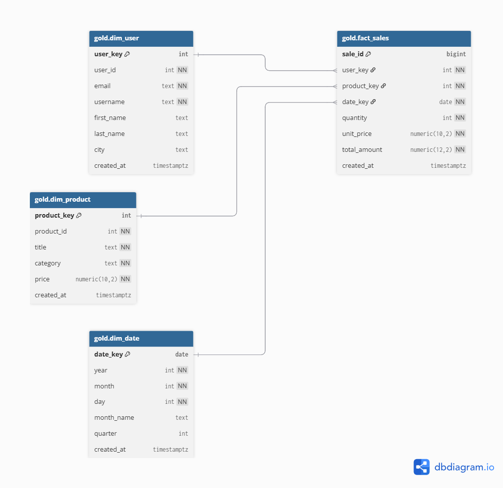

# Data Pipeline Lab

## Visão Geral

Este projeto implementa um pipeline completo de dados utilizando a arquitetura **Medallion (Bronze → Silver → Gold)** com:

- Python
- PostgreSQL
- Prefect (orquestração)
- Docker Compose

O pipeline extrai dados de uma API pública de e-commerce, processa e transforma as informações em camadas organizadas e entrega um **modelo dimensional em formato Star Schema**, pronto para consumo analítico.

---

## Objetivos do Projeto

- Construir um pipeline ETL resiliente e idempotente
- Organizar os dados em camadas seguindo boas práticas
- Garantir integridade referencial no Data Warehouse
- Disponibilizar um modelo dimensional para análises
- Permitir execução completa via Docker

---

## Arquitetura

O pipeline segue o padrão Medallion:

### Bronze (Raw)
- Ingestão de dados brutos em JSON
- Armazenamento fiel ao formato da API
- Upsert para evitar duplicidades

### Silver (Tratamento e Estruturação)
- Normalização dos dados
- Tipagem explícita
- Tratamento de campos
- Enriquecimentos básicos

### Gold (Modelo Dimensional)
- Modelo Star Schema
- Uso de chaves substitutas (surrogate keys)
- Integridade referencial via foreign keys
- Otimizado para consultas analíticas

#### Fato
- `fact_sales`

#### Dimensões
- `dim_user`
- `dim_product`
- `dim_date`

---

## 📊 Modelo Dimensional

O modelo dimensional foi estruturado em formato Star Schema.



---

## Estratégia de Carga

O pipeline suporta:

- Full Refresh
- Carga Incremental (padrão)

A carga incremental utiliza `ON CONFLICT` para garantir:

- Idempotência
- Reprocessamento seguro
- Ausência de duplicidades

## Setup e Execução

### Pré-requisitos

- Docker
- Docker Compose
- Make (opcional, mas recomendado)

---
## Subindo o Ambiente Completo

Para subir PostgreSQL + Prefect Server + Prefect Worker:

```bash
make up
```

Ou manualmente:

```bash
docker compose -f docker-compose.win.yml up -d
```

Após subir os containers, a interface do Prefect estará disponível em:

```
http://localhost:4200
```

---

## Executando o Pipeline

### 1 - Execução local (sem deployment)

Executa o pipeline diretamente via Python (útil para desenvolvimento):

```bash
make run
```

Ou manualmente:

```bash
python -m etl
```

---

### 2 - Criando / Atualizando o Deployment no Prefect

Para registrar o pipeline no Prefect:

```bash
make deploy
```

Ou manualmente:

```bash
prefect deploy
```

Selecione o deployment existente (ex: `medallion-etl-local`)  

---

### 3 - Executando via Prefect

Após o deploy, é possível executar:

Pela interface web:

```
http://localhost:4200
```

Ou via CLI:

```bash
prefect deployment run "medallion-etl/medallion-etl-local"
```

---

## Derrubando o Ambiente

```bash
make down
```

Ou manualmente:

```bash
docker compose -f docker-compose.win.yml down
```

## 🔍 Validando os Dados (Analytics)

Após a execução do pipeline, você pode validar os resultados e executar consultas analíticas diretamente no Data Warehouse.

O arquivo `sql/analytics_examples.sql` contém exemplos de queries sobre o modelo dimensional (camada **Gold**), incluindo consultas na `fact_sales`, `dim_user`, `dim_product` e `dim_date`.

